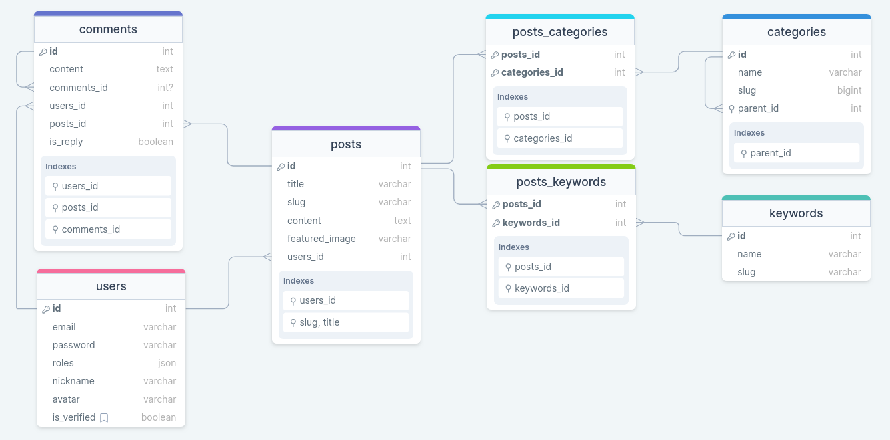
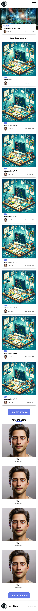
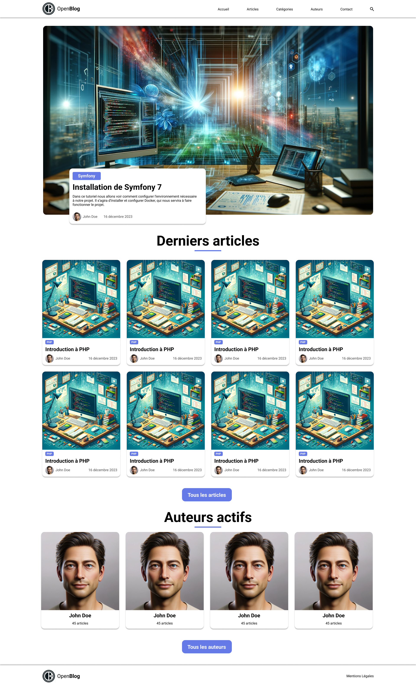
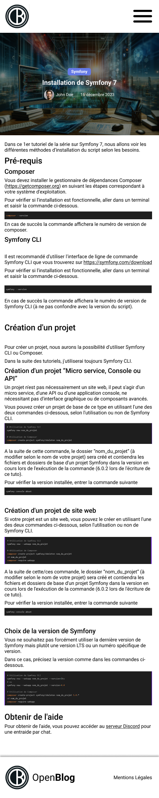
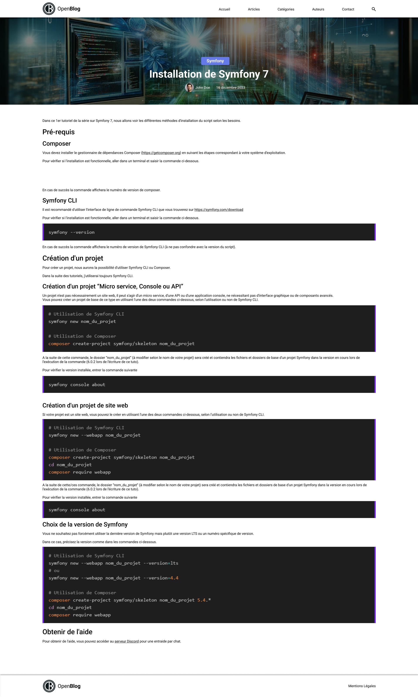

# Sommaire
- [Sommaire](#sommaire)
- [Le projet](#le-projet)
  - [Technologies](#technologies)
  - [Base de données](#base-de-données)
  - [Maquettes](#maquettes)
    - [Page d'accueil](#page-daccueil)
      - [Mobile](#mobile)
      - [Desktop](#desktop)
    - [Page d'un article](#page-dun-article)
      - [Mobile](#mobile-1)
      - [Desktop](#desktop-1)

# Le projet

Open**Blog** est à l'origine un **blog multi auteurs** créé avec **Symfony 7** ...

## Technologies

Open**Blog** sera développé en utilisant :

- Docker
- Symfony 7
- Mysql 8.0
- PHP 8.3
- PHPMyAdmin
- Sass

## Base de données
Vous trouverez le **schéma de base de données** ici : https://drawsql.app/teams/ma-team-7/diagrams/blog-symfony-7

## Maquettes

Les maquettes sont disponibles sur [Figma](https://www.figma.com/file/WBF5w0A2qQ6qCfcMPP4Per/OpenBlog?type=design&node-id=0%3A1&mode=design&t=Fm5lnbz8ojK7uSlb-1)

### Page d'accueil

#### Mobile

#### Desktop

### Page d'un article

#### Mobile

#### Desktop

